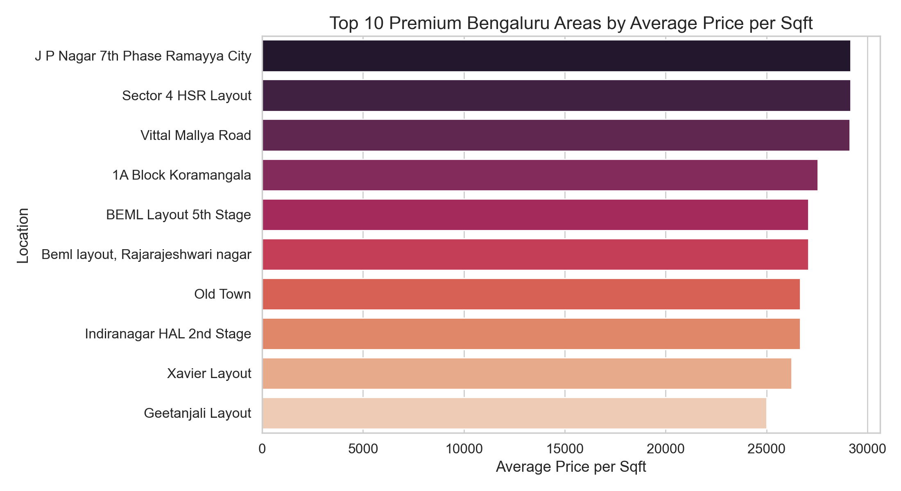
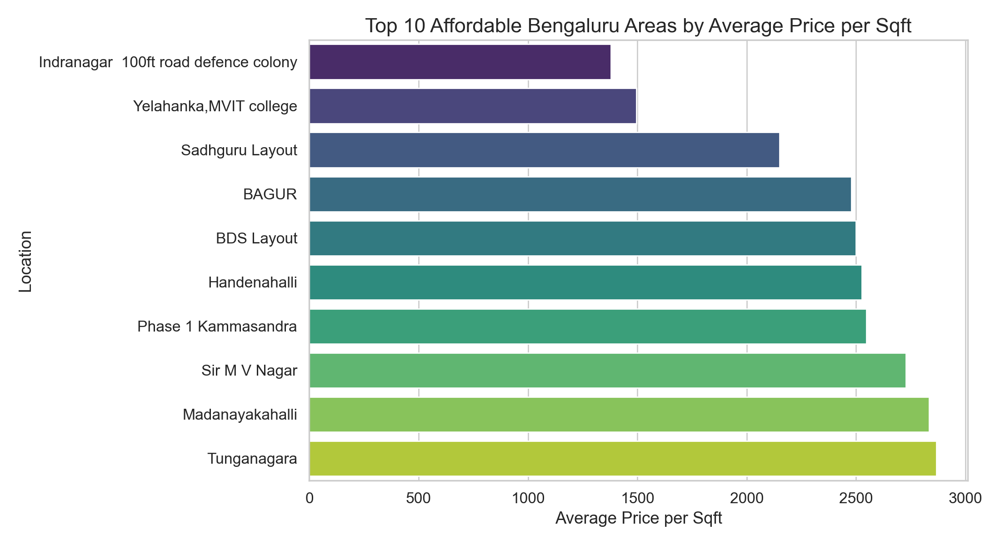

# Bengaluru Rental Analytics Dashboard

## Live Demo
https://bengaluru-housing-analytics-dashboard-gmbyx4py4ovmaqbirv4hou.streamlit.app/

## Overview
Interactive Bengaluru housing analytics for startup-ready decision support. This project surfaces premium neighbourhoods, affordable pockets, BHK pricing trends, and price-per-sqft segmentation using an exploratory dashboard backed by clean data and predictive analytics.

## Problem Statement
Bengaluru real estate is highly local. The goal is to identify the most expensive and most affordable neighbourhoods, understand how BHK impacts price, and provide an analyst-ready dashboard for recruiters, startups, and data science internships.

## Business Insights
- Premium neighbourhoods are best identified by price per sqft rather than nominal price alone.
- Affordable pockets exist in Bengaluru, offering clear recommendations for value-driven customers.
- BHK is a strong pricing signal, but location and size together are more powerful when evaluated with price per sqft.
- Interactive filtering is essential for business users to compare specific locations and budget segments.

## Live Demo
- Live app: `https://share.streamlit.io/<your-username>/Bengaluru_Rental_Analytics/main/app.py`

## GitHub
- Repository: `https://github.com/<your-username>/Bengaluru_Rental_Analytics`

## Dataset
- `data/bengaluru_cleaned_data.csv` — cleaned dataset used by the dashboard

## Tech Stack
- Python
- pandas
- Streamlit
- Plotly
- scikit-learn

## Features
- Interactive sidebar filters for location, BHK, and price range
- Premium and affordable location charts
- BHK price comparison and price-per-sqft distribution
- Cleaned Bengaluru data and responsive dashboard layout
- Professional README and recruiter-friendly structure

## Screenshots
<p float="left">
  
  
</p>


## Project Structure
- `app.py` — main Streamlit dashboard
- `data/` — cleaned dataset and raw input if included
- `notebooks/` — exploratory notebook assets
- `screenshots/` — portfolio visuals
- `README.md` — project documentation

## Run locally
```bash
cd Bengaluru_Rental_Analytics
python3 -m venv .venv
source .venv/bin/activate
pip install -r requirements.txt
streamlit run app.py
```

## Future Improvements
- Add Bengaluru neighbourhood map visualization with Folium or Plotly mapbox
- Add rental growth forecasting and trend projections
- Add clustering to segment premium, mid-range, and budget zones
- Publish the dashboard on Streamlit Cloud for live sharing
